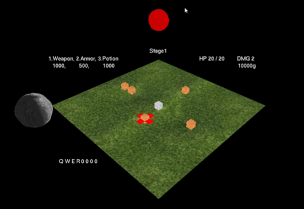

# GraphicsTP

## Project Description

Computer graphics termproject that is simple RPG Game using .

When you execute this project, then add *. image file.

The list of bmp files is as follows:

- angel.bmp
- boss.bmp
- brain.bmp
- chicken.bmp
- desert.bmp
- devil.bmp
- earth.bmp
- grass.bmp
- hell.bmp
- lion.bmp
- moon.bmp
- skin.bmp
- slime.bmp
- snow.bmp
- sun.bmp
- water.bmp

## Game Description

### Ingame Image
 

### Rule

- The goal is for the player to strengthen himself by defeating monsters and defeat the boss.
- Players can use skil to attack enemies in a certain range.
- By defeating monsters, players gain gold and can spend gold to strengthen themselves.
- Monsters and bosses use skills to attack players.
- Enemies take preliminary action before attacking, and will be attacked if they do not leave the action range.

### Key

- Up, down, left and right: The player can be moved in the direction the user wants.
- Q, E, R: The player attacks enemies in a specific range.
- W: The player becomes invincible for 2 seconds and cannot be attacked.
- 1, 2: The player purchases equipment to increase attack power or total health.
- 3: The player purchases a potion to increase current health.
- g: Move the player to the next stage.